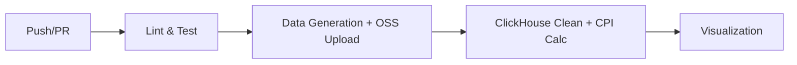

# 电商价格指数大数据分析系统 — 设计文档

> **课程设计大作业** | 权重：15%

---

## 一、需求分析

### 1.1 项目背景

电商平台每日产生海量交易数据，价格波动是反映市场供需关系的重要指标。本项目构建一套自动化数据处理流水线，实现从原始交易数据到价格指数（CPI）可视化的全链路处理。

### 1.2 功能需求

| 编号 | 功能 | 描述 |
|------|------|------|
| F1 | 模拟数据生成 | 生成约 100MB 电商三表数据集（商品/价格/分类） |
| F2 | 云存储上传 | 将原始数据上传至阿里云 OSS，模拟生产环境数据湖 |
| F3 | 数据清洗 | 过滤空值、负价格、异常超大值等脏数据 |
| F4 | 价格指数计算 | 基于 Laspeyres / Paasche / Fisher 公式计算日度 CPI |
| F5 | 可视化 | 生成 CPI 趋势折线图、均价走势图、数据质量监控图 |
| F6 | CI/CD | GitHub Actions 实现自动化测试-生成-计算-可视化的全流程 |

---

## 二、技术选型

| 组件 | 技术选型 | 选型理由 |
|------|----------|----------|
| 编程语言 | Python 3.10+ | 数据处理生态完善（pandas/numpy） |
| 对象存储 | 阿里云 OSS | 课程要求；与阿里云生态集成 |
| OLAP 引擎 | ClickHouse | 列式存储，适合海量数据聚合分析 |
| 可视化 | Matplotlib + Seaborn | 成熟稳定，支持中文字体 |
| CI/CD | GitHub Actions | 免费、易配置、与 GitHub 深度集成 |
| 测试框架 | Pytest | Python 标准测试框架 |

---

## 三、数据表设计

### 3.1 分类维度表 (category_dim)

| 字段 | 类型 | 说明 |
|------|------|------|
| category_id | UInt32 | 分类 ID (PK) |
| category_name | String | 分类名称 |
| parent_id | UInt32 | 父级分类 ID |
| level | UInt8 | 层级 (1/2/3) |

### 3.2 商品信息表 (product_info)

| 字段 | 类型 | 说明 |
|------|------|------|
| product_id | UInt32 | 商品 SKU ID (PK) |
| product_name | String | 商品名称 |
| category_id | UInt32 | 所属分类 ID (FK) |
| brand | String | 品牌 |
| unit | String | 计量单位 |
| launch_date | Date | 上架日期 |

### 3.3 价格明细表 (price_detail)

| 字段 | 类型 | 说明 |
|------|------|------|
| detail_id | UInt64 | 明细 ID (PK) |
| product_id | UInt32 | 商品 ID (FK) |
| price_date | Date | 价格日期 |
| price | Float64 | 实际售价 |
| original_price | Float64 | 原价/吊牌价 |
| discount | Float64 | 折扣率 |
| stock_status | UInt8 | 库存状态 (0/1) |

---

## 四、价格指数计算方法

### 4.1 Laspeyres（拉氏指数）

$$P_L = \frac{\sum P_t \times Q_0}{\sum P_0 \times Q_0} \times 100$$

以**基期销量**为权重，反映"花同样钱能否买到基期商品组合"。

### 4.2 Paasche（派氏指数）

$$P_P = \frac{\sum P_t \times Q_t}{\sum P_0 \times Q_t} \times 100$$

以**报告期销量**为权重，反映"当前消费结构下的价格变化"。

### 4.3 Fisher（费雪理想指数）

$$P_F = \sqrt{P_L \times P_P}$$

拉氏与派氏的几何平均，弥补两者偏差，被认为是"理想指数"。

---

## 五、系统架构

```
┌──────────────────────────────────────────────────┐
│                   数据生成层                        │
│  data_generator.py → 100MB CSV (三表)              │
│  商品 5,000 SKU × 365 天 = ~183 万行价格记录        │
└──────────────────────┬───────────────────────────┘
                       │ oss_upload.py
                       ▼
┌──────────────────────────────────────────────────┐
│                 阿里云 OSS 存储层                    │
│  oss://bucket/ecommerce/raw/                      │
│  ├── category_dim.csv                              │
│  ├── product_info.csv                              │
│  └── price_detail.csv                              │
└──────────────────────┬───────────────────────────┘
                       │ clickhouse_connect
                       ▼
┌──────────────────────────────────────────────────┐
│               ClickHouse 计算引擎层                 │
│  ck_price_calc.py                                  │
│  ├── 建表 (MergeTree, 按月分区)                     │
│  ├── 清洗 (5 类脏数据过滤)                          │
│  └── 计算 (Laspeyres/Paasche/Fisher)               │
└──────────────────────┬───────────────────────────┘
                       │ cpi_daily_index.csv
                       ▼
┌──────────────────────────────────────────────────┐
│                   可视化展示层                       │
│  draw_cpi_trend.py                                 │
│  ├── CPI 多指数对比折线图                           │
│  ├── 日均价格走势图                                 │
│  └── 有效商品数量柱状图                              │
└──────────────────────────────────────────────────┘
```

---

## 六、CI/CD 流水线设计



| 阶段 | 内容 | 产出物 |
|------|------|--------|
| 1. Lint & Test | flake8 + pytest | 测试报告 |
| 2. Data | 生成 100MB 数据 + OSS 上传 | Artifact: raw-data |
| 3. Calc | ClickHouse 建表 + 清洗 + 指数计算 | Artifact: results |
| 4. Viz | 趋势图生成 | Artifact: images |

---

## 七、安全性设计

- **密钥管理**：所有凭据通过环境变量注入，`.env` 和 `config.yaml` 已加入 `.gitignore`
- **参数化查询**：ClickHouse 客户端使用 `clickhouse-connect` 的参数化接口，防止 SQL 注入
- **数据校验**：上传后对比本地 MD5 与 OSS ETag，确保数据完整性
