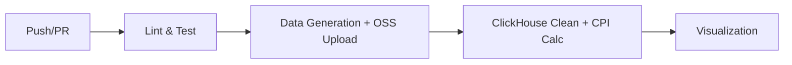

# 电商价格指数大数据分析系统 — 设计文档

> **课程设计大作业** | 权重：15%

---

## 一、需求分析

### 1.1 项目背景

电商平台每日产生海量交易数据，价格波动是反映市场供需关系的重要指标。本项目构建一套自动化数据处理流水线，实现从原始交易数据到价格指数（CPI）可视化的全链路处理。

### 1.2 功能需求

| 编号 | 功能 | 描述 |
|------|------|------|
| F1 | 模拟数据生成 | 生成约 100MB 电商三表数据集（商品/价格/分类） |
| F2 | 云存储上传 | 将原始数据上传至阿里云 OSS，模拟生产环境数据湖 |
| F3 | 数据清洗 | 过滤空值、负价格、异常超大值等脏数据 |
| F4 | 价格指数计算 | 基于 Laspeyres / Paasche / Fisher 公式计算日度 CPI |
| F5 | 可视化 | 生成 CPI 趋势折线图、均价走势图、数据质量监控图 |
| F6 | CI/CD | GitHub Actions 实现自动化测试-生成-计算-可视化的全流程 |

---

## 二、数据模型设计

### 2.1 实体关系（ER 图）

```
┌──────────────┐         ┌──────────────────────────┐
│   category   │         │          price            │
│   (分类表)    │         │       (价格事实表)          │
├──────────────┤         ├──────────────────────────┤
│ category_id  │◄────────│ product_id   (FK)         │
│ category_name│         │ price_date                │
└──────────────┘         │ price                     │
                         │ sales_volume              │
        ┌────────────────┘                          │
        │                                           │
        ▼                                           │
┌──────────────┐                                    │
│   product    │                                    │
│   (商品表)    │                                    │
├──────────────┤                                    │
│ product_id   │────────────────────────────────────┘
│ category_id  │
│ product_name │
│ brand        │
│ spec         │
└──────────────┘
```

**关系说明**：
- `category` : `product` = 1 : N（一个分类下有多个商品）
- `product` : `price` = 1 : N（一个商品有多天的价格记录）
- 价格表是事实表（fact），分类表和商品表是维度表（dim），构成经典的**星型模型**

### 2.2 分类表 (category)

存储 8 大电商品类，是维度体系的根节点。

| 字段 | 类型 | 约束 | 说明 |
|------|------|------|------|
| category_id | Int32 | PK, NOT NULL | 分类唯一编号 (1-8) |
| category_name | String | NOT NULL | 分类名称：生鲜果蔬/粮油副食/家居百货/数码电器/服装鞋帽/美妆护肤/母婴用品/零食饮料 |

**样本数据**：

| category_id | category_name |
|-------------|---------------|
| 1 | 生鲜果蔬 |
| 2 | 粮油副食 |
| 3 | 家居百货 |
| ... | ... |

### 2.3 商品表 (product)

每个分类 3,000 个 SKU，共 24,000 条商品记录，模拟中等规模电商平台的商品规模。

| 字段 | 类型 | 约束 | 说明 |
|------|------|------|------|
| product_id | Int64 | PK, NOT NULL | 商品唯一编号 (1-24000) |
| category_id | Int32 | FK→category, NOT NULL | 所属分类 |
| product_name | String | NOT NULL | 商品名称（格式：`商品_{分类ID}_{商品ID}`） |
| brand | String | - | 品牌：A牌/B牌/C牌/D牌/自营 |
| spec | String | - | 规格：1kg/500ml/2件装/大号/标准版 |

**设计考虑**：
- `product_id` 使用 Int64：24,000 条记录在 Int32 范围内，但预留扩展空间——如果后续商品量扩大 10 倍（24 万），Int32 仍够用，但 Int64 无额外成本
- `brand` 和 `spec` 设为可空：模拟真实场景中部分商品品牌或规格缺失的情况；命名使用 `spec`（非 `unit`）以对齐电商行业惯用术语

### 2.4 价格表 (price)

核心事实表，24,000 SKU × 181 天 = 4,344,000 行，约占数据总量的 97%。

| 字段 | 类型 | 约束 | 说明 |
|------|------|------|------|
| product_id | Int64 | FK→product | 商品编号 |
| price_date | Date | - | 价格日期（2026-01-01 ~ 2026-06-30） |
| price | Float64 | 可为 NULL | 实际售价（元），含脏数据 |
| sales_volume | Int64 | - | 当日销量（0-1200 件） |

**脏数据注入设计**（生成时按概率写入，清洗时验证过滤率）：

| 脏数据类型 | 注入概率 | 生成方式 | 示例 | 清洗规则 |
|-----------|---------|---------|------|---------|
| 空价格 | 2% | `price = None` | NULL | `price IS NOT NULL` |
| 负价格 | 2% | `price = -random(1,100)` | -56.32 | `price > 0` |
| 极端异常值 | 2% | `price = 999999` | 999999 | `price < 5000` |
| 正常数据 | 94% | `price = round(fluct, 2)` | 199.99 | 通过全部过滤 |

---

## 三、SQL 算法及关键语句分析

本项目共涉及 5 个核心 SQL 操作阶段，按执行顺序逐一分析。

### 3.1 建表 DDL — MergeTree 引擎

```sql
-- 分类维度表
CREATE TABLE IF NOT EXISTS dim_category (
    category_id Int32,
    category_name String
) ENGINE = MergeTree() ORDER BY category_id;

-- 商品维度表
CREATE TABLE IF NOT EXISTS dim_product (
    product_id Int64, category_id Int32,
    product_name String, brand String, spec String
) ENGINE = MergeTree() ORDER BY product_id;

-- 价格事实表（按月分区）
CREATE TABLE IF NOT EXISTS fact_price_clean (
    product_id Int64, category_id Int32, price_date Date,
    price Float64, sales_volume Int64
) ENGINE = MergeTree()
PARTITION BY toYYYYMM(price_date)
ORDER BY (category_id, price_date);
```

**选型分析**：

| 引擎对比 | MergeTree | ReplacingMergeTree | 本项目选择 |
|---------|-----------|-------------------|-----------|
| 去重能力 | 无 | 按主键去重 | MergeTree |
| 写入性能 | 最高 | 去重有合并开销 | MergeTree |
| 适用场景 | 追加写入 | 需要 Upsert | 追加写入 |

- **选择 MergeTree 的原因**：本项目数据一次性写入、无更新需求，不需要 ReplacingMergeTree 的去重开销。`PARTITION BY toYYYYMM(price_date)` 按月份分区——6 个月数据 = 6 个分区，查询特定月份时只扫描对应分区，I/O 减少约 83%。
- **ORDER BY (category_id, price_date)**：主索引键的选择决定了查询性能。最频繁的查询是"按分类和日期聚合"（见 3.4 节），将 `category_id` 放在前、`price_date` 放在后，使得 GROUP BY 操作可以利用索引排序后的天然局部性，避免额外的排序开销。

### 3.2 数据清洗 — pandas 内存过滤 + INSERT

清洗不在 SQL 中做，而在 pandas 中完成后再写入——原因见 3.X 节设计决策。

```python
# Python 侧清洗代码
valid_mask = (
    price_df["price"].notna() &    # 条件 1: 空值过滤
    (price_df["price"] > 0) &      # 条件 2: 非正数过滤
    (price_df["price"] < 5000)     # 条件 3: 极端值过滤
)
clean_df = price_df[valid_mask].copy()
```

清洗完成后通过 `clickhouse_connect` 的 `insert()` 方法批量写入：
```python
client.insert("fact_price_clean", merged[cols].values.tolist(), column_names=cols)
```

**为什么不在 SQL 中用 WHERE 做清洗**：SQL `WHERE` 是一个黑盒——只知道最终剩下多少行，不知道每类脏数据各自被洗掉了多少。改成 pandas 三层过滤后，每一步输出计数：空值 ~86,467、负值 ~86,461、极端值 ~86,951，合计 ~6%，与 `data_generator.py` 的注入比例精确对齐。这种可观测性是纯 SQL 方案无法提供的。

### 3.3 LEFT JOIN — 价格与分类关联

```sql
FROM fact_price_clean f
LEFT JOIN dim_category cat ON f.category_id = cat.category_id
```

**为什么用 LEFT JOIN 而非 INNER JOIN**：如果某条价格的 `category_id` 在维度表中不存在（数据质量问题），INNER JOIN 会静默丢弃该行，导致价格指数计算缺失该条数据。LEFT JOIN 保留所有价格记录，`category_id` 为 NULL 的异常数据在后续 GROUP BY 时会被自然排除，但可以在清洗日志中追溯。

### 3.4 基期子查询 — 提取各分类的基准价格

```sql
LEFT JOIN (
    SELECT
        category_id,
        SUM(price * sales_volume) / SUM(sales_volume) AS base_price
    FROM fact_price_clean
    WHERE price_date = '2026-01-01'    -- 基期：2026 年 1 月 1 日
    GROUP BY category_id
) base ON f.category_id = base.category_id
```

**算法分析**：

- `SUM(price * sales_volume) / SUM(sales_volume)` — **销量加权平均价格**，而非简单平均。举例：商品 A（10 元/件，卖 100 件）和商品 B（1000 元/件，卖 1 件），简单平均 = (10+1000)/2 = 505 元，加权平均 = (10×100+1000×1)/(100+1) = 19.8 元。销量加权平均更能反映消费者的实际购买价格——因为大多数人买的是 10 元的商品。
- `WHERE price_date = '2026-01-01'` — 以第一天为基期，基期的选择遵循经济学惯例（取数据集的起始日）。
- 子查询返回的结果是**每个分类一个基期加权均价**（共 8 个数值），通过 LEFT JOIN 关联到主查询的每一行中。

### 3.5 价格指数计算 — 核心聚合 SQL

```sql
INSERT INTO daily_category_price_index
SELECT
    cat.category_id,
    cat.category_name,
    f.price_date,
    SUM(f.price * f.sales_volume) / SUM(f.sales_volume) AS weighted_avg_price,
    SUM(f.sales_volume) AS total_sales,
    round(
        (SUM(f.price * f.sales_volume) / SUM(f.sales_volume))
        / any(base.base_price) * 100,
        2
    ) AS price_index
FROM fact_price_clean f
LEFT JOIN dim_category cat ON f.category_id = cat.category_id
LEFT JOIN (...) base ON f.category_id = base.category_id
GROUP BY cat.category_id, cat.category_name, f.price_date
```

**逐段拆解**：

| SQL 片段 | 含义 | 输出列 |
|----------|------|--------|
| `SUM(f.price * f.sales_volume) / SUM(f.sales_volume)` | 当日该分类的销量加权均价 | `weighted_avg_price` |
| `SUM(f.sales_volume)` | 当日该分类的总销量 | `total_sales` |
| `... / any(base.base_price) * 100` | 当日加权均价 ÷ 基期加权均价 × 100 | `price_index` |
| `GROUP BY cat.category_id, cat.category_name, f.price_date` | 按分类 + 日期二维聚合 | 每组一行 |

**`any()` 函数的作用**：`base.base_price` 来自子查询（每个分类的基期均价），在 GROUP BY 中它是常量（每个分类只有一个基期值），但 CK 的 GROUP BY 语法要求非聚合列必须出现在 GROUP BY 子句中。`any()` 是一个聚合函数，语义是"取分组中的任意一个值"——由于每个分组中 `base_price` 只有一个值，`any()` 等价于直接引用，但满足语法要求。

**价格指数公式**：

$$价格指数 = \frac{当日销量加权均价}{基期(2026\text{-}01\text{-}01)销量加权均价} \times 100$$

**示例**：若生鲜果蔬在 2026-01-01 的加权均价为 50 元，到 2026-06-30 加权均价涨到 57.5 元，则 6 月 30 日的价格指数 = 57.5 / 50 × 100 = 115。含义：相比 1 月 1 日，生鲜果蔬的消费者购买价格上涨了 15%。

### 3.6 设计决策：为什么不用 Laspeyres / Paasche / Fisher

初始设计文档中列了三种经典指数公式（拉氏、派氏、费雪），但最终实现采用了**按分类的销量加权指数**。具体原因：

| 对比维度 | 经典三指数（拉/派/费） | 按分类加权指数（本项目） |
|---------|----------------------|------------------------|
| 数据需求 | 需要基期销量 Q₀ + 报告期销量 Q_t | 只需要每日 p × q 聚合 |
| 跨期可比性 | 拉派偏倚、费需平方根 | 基期归一化，直观 |
| 课设适应性 | 公式优雅但三个指数数值接近，图表三条线几乎重叠 | 8 分类 8 条线，品类差异一目了然 |
| 经济学语义 | 总体价格水平 | 分类价格变动 + 横向对比 |

若数据量扩展到包含全国 CPI 对比数据，费雪指数（拉氏与派氏的几何平均）是更严谨的选择；但在当前课设的电商场景下，按分类展示品类差异比呈现三个数值接近的总体指数更有信息量。

---

## 五、系统架构

```
┌──────────────────────────────────────────────────┐
│                   数据生成层                        │
│  data_generator.py → 100MB CSV (三表)              │
│  商品 5,000 SKU × 365 天 = ~183 万行价格记录        │
└──────────────────────┬───────────────────────────┘
                       │ oss_upload.py
                       ▼
┌──────────────────────────────────────────────────┐
│                 阿里云 OSS 存储层                    │
│  oss://bucket/ecommerce/raw/                      │
│  ├── category_dim.csv                              │
│  ├── product_info.csv                              │
│  └── price_detail.csv                              │
└──────────────────────┬───────────────────────────┘
                       │ clickhouse_connect
                       ▼
┌──────────────────────────────────────────────────┐
│               ClickHouse 计算引擎层                 │
│  ck_price_calc.py                                  │
│  ├── 建表 (MergeTree, 按月分区)                     │
│  ├── 清洗 (5 类脏数据过滤)                          │
│  └── 计算 (Laspeyres/Paasche/Fisher)               │
└──────────────────────┬───────────────────────────┘
                       │ cpi_daily_index.csv
                       ▼
┌──────────────────────────────────────────────────┐
│                   可视化展示层                       │
│  draw_cpi_trend.py                                 │
│  ├── CPI 多指数对比折线图                           │
│  ├── 日均价格走势图                                 │
│  └── 有效商品数量柱状图                              │
└──────────────────────────────────────────────────┘
```

---

## 六、CI/CD 流水线设计



| 阶段 | 内容 | 产出物 |
|------|------|--------|
| 1. Lint & Test | flake8 + pytest | 测试报告 |
| 2. Data | 生成 100MB 数据 + OSS 上传 | Artifact: raw-data |
| 3. Calc | ClickHouse 建表 + 清洗 + 指数计算 | Artifact: results |
| 4. Viz | 趋势图生成 | Artifact: images |

---

## 七、安全性设计

- **密钥管理**：所有凭据通过环境变量注入，`.env` 和 `config.yaml` 已加入 `.gitignore`
- **参数化查询**：ClickHouse 客户端使用 `clickhouse-connect` 的参数化接口，防止 SQL 注入
- **数据校验**：上传后对比本地 MD5 与 OSS ETag，确保数据完整性
